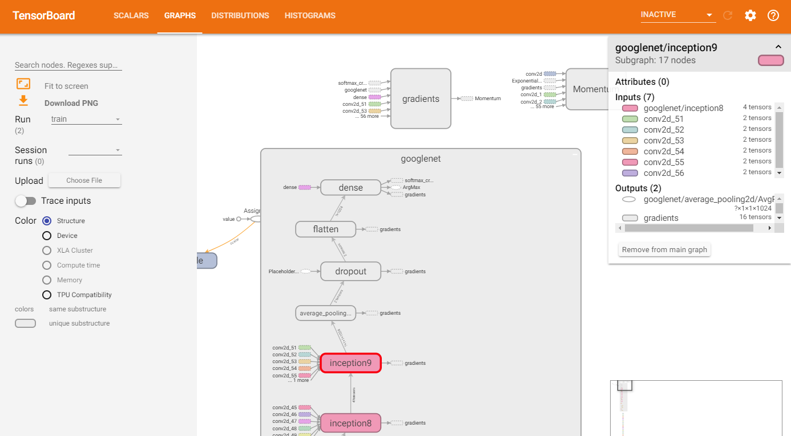

# MyDNN

This repository contains my implementations of deep neural networks.

I will also use the networks to solve the CIFAR-10 classification problem in terms of checking their sanity.

## Requirements

```
numpy
matplotlib
tensorflow
scikit-learn
```


## CIFAR-10

The datasets should be loaded in folder ```data```.

The original directories stucture is as follow:
```
+---data
|   +---labels.txt      # labels in cifar-10
|   +---train
|   |   +--- 0_frog.png
|   |   +--- 1_truck.png
|   |   +--- ...
|   +---test
|   |   +--- 0_cat.png
|   |   +--- 1_ship.png 
|   |   +--- ...
```


## Networks

GoogLeNet



## TODO

1. implement VGGNet
2. implement InceptionV3
3. implement ResNet
4. implement MobileNet
5. use tensorflow data pipeline
6. add another datasets
7. add object detection task
